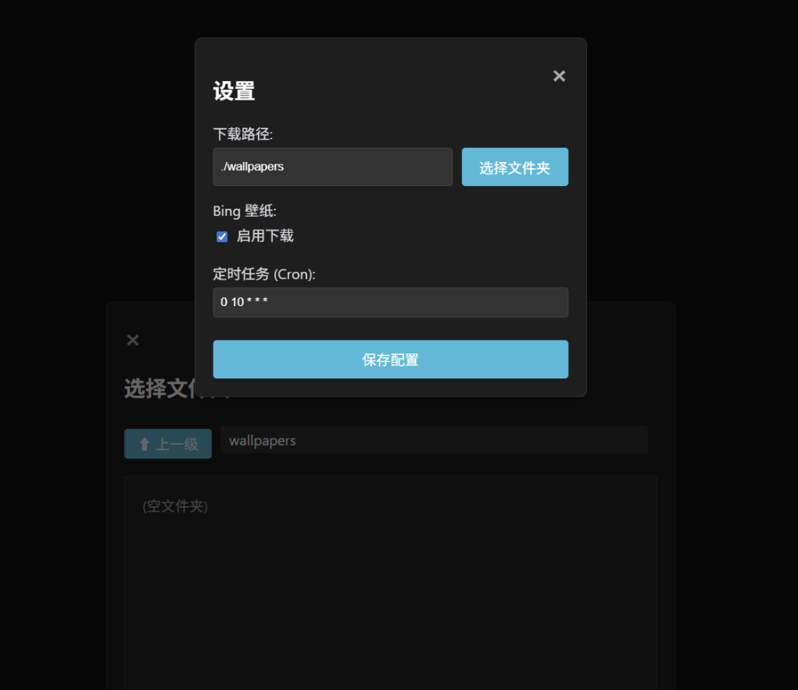

# 壁纸管理工具 (Wallpaper Manager)

一个 Go 语言编写的跨平台应用，用于下载和管理 Bing 壁纸。



## 功能
- **Bing 壁纸**: 自动下载每日 Bing 壁纸，支持**最近 16 天历史回溯**。
- **CLI 模式**: 默认模式，命令行一次性运行下载并退出。
- **API 服务模式**: 支持后台运行，提供定时任务和 API 接口（供可视化模块使用）。
- **Docker 支持**: 支持容器化部署。
- **跨平台**: 支持 Windows 和 Linux。

## 使用说明

### 运行模式

程序支持两种运行模式：

1.  **CLI 模式 (默认)**
    立即执行一次下载任务并退出。
    ```bash
    ./WM
    # 或显式指定
    ./WM -mode cli
    ```

2.  **API 服务模式**
    启动定时任务调度器和 API 服务器（不含 Web UI）。
    ```bash
    ./WM -mode server
    ```
    API 监听端口默认为 8080 (可在 `config.yaml` 中配置)。

### 配置
配置文件 `config.yaml`：
```yaml
server:
  port: 8080
download:
  path: "./wallpapers"
  bing:
    enabled: true
    schedule: "0 10 * * *"
```

### 运行 (开发)
```bash
go run cmd/server/main.go
```

### 构建
使用提供的构建脚本:

**Windows (cmd/powershell):**
```bat
build.bat
```

**Linux/Mac (bash):**
```bash
./build.sh
```
输出位于项目根目录。

### Docker
```bash
docker-compose up -d
```

## 开发
- **测试**: `go test ./...`